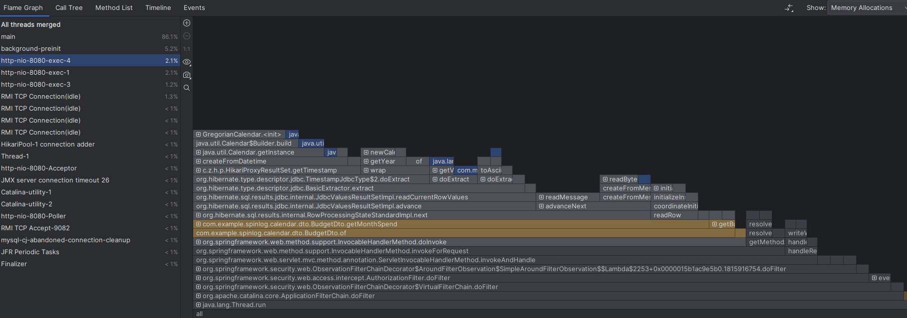
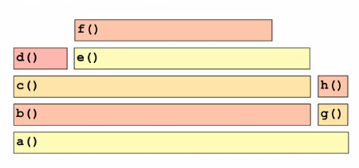

# Flame Graph

Flame Graph란 프로그램의 CPU 사용량 & 메모리 사용량을 시각화하는 방법 중 하나로,  
프로그램의 각 함수가 얼마나 오랜 시간을 소비하는지를 보여준다.

---

## Flame Graph의 구성

위 사진은 인텔리제이에서 Flame Graph를 생성한 결과이다.  
(메모리 사용량을 보여주는 Flame Graph)

사각형 한개가 함수를 나타내며,  
사각형의 가로 길이가 함수가 소비한 시간(메모리 사용량)을 나타낸다.

이때 해당 함수에서 호출한 다른 함수들은  
해당 함수의 사각형 위에 쌓아 올려져 나타난다.

---

## Flame Graph 예시

위 사진에서  
f() 함수는 a() -> b() -> c() -> e() -> f() 순으로 호출되었음을 알 수 있다.

> 그리고 c() 함수에서  
> d() 함수를 호출한 다음에 e() 함수를 호출했음을 알 수 있다.  
> (d 사각형 옆에 바로 e 사각형이 나타난 것을 보면 알 수 있다)

그리고 d() 함수와 e() 함수의 가로 길이를 비교하면,  
e() 함수가 d() 함수보다 더 많은 시간을 소비했음을 알 수 있다.  
(가로 길이가 길수록 더 많은 시간을 소비한다고 볼 수 있다)

> 위 그림 예시는 CPU 사용량을 보여주는 Flame Graph이다.  
> (메모리 사용량을 보여주는 Flame Graph도 동일한 방식으로 이해할 수 있다)

---

