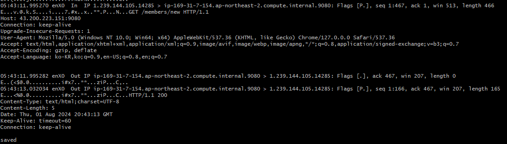

## tcpdump

tcpdump 명령어는 네트워크 패킷을 캡처하는 명령어이다.

### 특정 포트의 패킷만 캡처

`sudo tcpdump -i any port {port}`

`-i` 옵션: 인터페이스를 지정하는 옵션  
`any` 옵션: 모든 인터페이스를 지정하는 키워드, TCP, UDP 패킷을 모두 캡처한다.  
`port` 옵션: 포트를 지정하는 키워드

### 특정 호스트의 패킷만 캡처

`sudo tcpdump -i host {host}`

`host' 옵션: 호스트를 지정하는 키워드  
(해당 host로 오고 가는 패킷만 캡처한다)

### 패킷 정보 보기

위 명령들은 패킷의 정보를 딱 한줄로 보여준다.

`sudo tcpdump -A -i any port {port}`

`-A` 옵션을 추가하면,  
위 명령은 패킷의 정보를 보여주는데, ASCII로 보여준다.  
이때 패킷의 정보를 자세하게 볼 수 있다.

이렇게 HTTP 요청/응답 패킷을 볼 수 있다.

### tcpdump flags

S : SYN – 연결요청  
F : FIN – 연결종료요청  
R : RST – 즉시연결종료  
P : PSH – 프로세스로 데이터전송  
U : URG – 긴급한 데이터에 데이터전송 우선순위를 할당.  
. : flag가 설정되지 않았음.