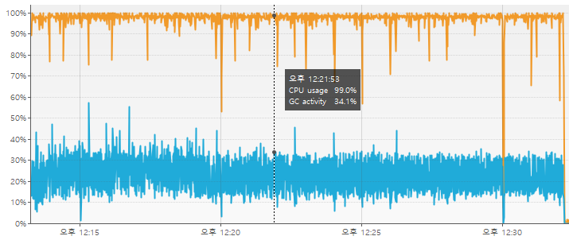
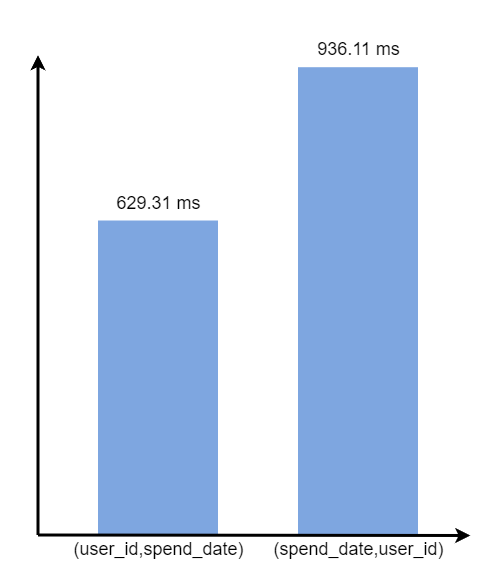

이 글은 API 서버에서 처리하는 메인 API의 성능 개선 과정을 다룬다.

---

## API 서버 구성

API 서버는 1대의 WAS 서버와 1대의 DB 서버로 구성되어 있다.


> WAS 서버 - Spring Boot  
> DB 서버 - RDS(MySQL)

---

## 메인 API란?

스핀로그 사이트에서 로그인을 한 유저는 메인 페이지에 들어가면,  
한 달 동안 작성한 일기들과 오늘 작성한 일기들을 볼 수 있다.

  

(위 데이터들을 가져오는 API)

메인 API는 사용자가 로그인 한 뒤에 항상 호출되는 API이다.  

> 스핀로그에서 가장 많이, 자주 호출되는 API 이다.

따라서 메인 API의 성능이 중요하다.

---

## 기존 메인 API 부하 테스트 결과

> nGrinder를 이용해 100명의 vuser가 20분 동안 메인 API를 호출했다.

TPS는 30으로 나왔다.

(VisualVM으로 확인한 결과)  
WAS 서버의 CPU 사용량 - 97%, 그 중 GC가 차지하는 비율 - 20%~35%  


(cloudwatch를 통해 확인한 결과)  
DB 서버의 CPU 사용량 - 약 20%  


---

## 원인 분석

병목은 WAS 서버에서 발생하고 있었다.

### 1. WAS 서버의 병목 원인

htop 명령어를 이용해 스레드별 CPU 사용량 분석 결과  
`VM Thread`와 `C2 CompilerThread0` 스레드의 CPU 사용량이 높게 나타났다.  
(이 스레드들은 GC 스레드, JIT 컴파일러 스레드)  
-> 어쩔 수 없이 사용해야 하는 스레드

그 외 스레드들은 모두 1%~2% 점유율을 보였다.

> 특정 스레드가 병목을 발생시키는 것이 아니라,  
> 단순히 부하가 많아 CPU 사용량이 높게 나온 것으로 보인다.

### 2. GC 점유율 높은 이유

만약 메모리 누수가 발생했다면 계속 힙 점유율이 높아져야 하는데,  
힙 점유율은 일정 힙 크기를 유지했다.  
(메모리 누수가 발생하지 않았다)

// todo 힙 덤프 분석

즉 단순히 Garbage Object가 많아서 발생한 문제로 파악된다.

---

## 성능 개선

### 1. 불필요한 커넥션 소모 방지

사용자가 요청 했을 때,  
요청에 대한 비즈니스 로직을 수행하기 전,  
`SessionAuthFilter`에서 세션 검증 과정을 거친다.

세션 검증 과정을 수행할 때 DB에 조회를 하는데,  
이로 인해 (비즈니스 로직과 별개인) 트랜잭션이 발생한다.  

-> DB 커넥션을 불필요하게 소모한다.


따라서 세션 인증 단계에서는 DB 조회는 하지 않고,  
세션의 존재 여부만 확인하도록 변경했다.  

> connection 1을 제거하고 비즈니스 로직에서  
> DB를 통해 세션 검증을 수행하는 로직을 추가했다.

### 2. DB에서 데이터를 가져올 때, 필터링하는 작업 추가

메인 API에서 한달치 articles와 오늘 articles를 가져오는 작업을 수행할 때,  
DB로부터 해당 유저의 모든 articles를 가져온 뒤,  
WAS에서 날짜에 대한 필터링 작업을 수행한다.


현재 API에서 원하는건 모든 articles가 아니라  
이번 달에 해당하는 articles 이다.

> WAS에서 필터링 작업을 수행하면서,  
> 실제로 응답하는 데이터보다 많은 Garbage Object가 생성되고 있다.

따라서 DB에서 필터링 작업을 수행하도록 변경했다.

> DB에서 필터링 작업을 하는 것이  
> WAS에서 필터링 작업을 하는 것보다 효율적이다.
> 
> 1. DB의 CPU 스펙이 WAS보다 좋다  
>    (DB vCPU: 2, WAS vCPU: 1)
> 2. DB에서 인덱스를 이용해 최적화가 가능하다.

### 3. DB 인덱스 활용

현재 articles을 조회하는 쿼리를 인덱스를 이용하기 위해  
쿼리를 변경했다.

변경 전 쿼리
```sql
select *
from articles a1_0
where
    a1_0.user_id = ? and 
    date_format(a1_0.spend_date, '%Y-%m') = ?; -- '2024-07' 형태로 넘어온다.
```

변경 후 쿼리
```sql
select *
from articles a1_0
where 
    a1_0.user_id = ? and 
    a1_0.spend_date between ? and ?;
```

> 인덱스를 사용하기 위해 칼럼을 변형 시키는 부분을 제거했다.

그리고 인덱스는 (user_id, spend_date)로 생성했다.  
((spend_date, user_id) 인덱스는 (user_id, spend_date) 인덱스보다 비효율적이기 때문에)

<details>
<summary>(spend_date, user_id) 인덱스가 (user_id, spend_date) 인덱스보다 비효율적인 이유</summary>

현재 메인 API에서 한달치 articles를 조회하기 위해 사용하는 SQL  
```sql
select *
from articles a1_0
where 
    a1_0.user_id = ? and 
    a1_0.spend_date between ? and ?;
```

user_id 필드는 동등 비교 조건으로 사용되었고,  
spend_date 필드는 범위 조건으로 사용되었다.

만약 인덱스가 (spent_date, user_id)로 생성되었다면,  
해당 인덱스에서 첫 번째 칼럼(spend_date)이 범위 검색을 수행할 때,  
뒤 칼럼(user_id)은 인덱스를 타지 못한다.

> 뒤 칼럼들은, 해당 조건을 이용해 인덱스의 범위를 결정할 수 없다.  
> (인덱스를 통해 읽은 레코드들이 맞는지 확인만 한다)

> 첫번째 칼럼만 작업 범위 결정 조건이 되고,  
> 그 이후의 칼럼들은 체크 조건이 된다.

하지만 (user_id, spend_date) 인덱스에서  
user_id을 동등 비교 조건으로 사용하기 때문에  
user_id, spend_date 모두 범위 검색을 수행한다.

> 이때는 두 칼럼 모두 작업 범위 결정 조건이 된다.

두 인덱스 성능 비교 그래프



위 사진은 동일한 쿼리에 대해 두 인덱스를 사용했을 때의 평균 실행 시간을 비교한 것이다.

(user_id, spend_date) 인덱스를 이용한 쿼리가 더 빠르게 실행된다.

</details>

---

## 성능 개선 결과

> cgroup을 이용해 자바 프로그램의 CPU 사용량을 60%로 제한했다.

TPS: 30 -> 205 로 증가했다.

(VisualVM으로 확인한 결과)  


WAS 서버의 CPU 사용량은 60%로 제한했음에도 불구하고  
TPS가 증가했다.

그리고 GC가 차지하는 비율도 5%로 대폭 감소했다.

---

## 추가 개선

### 4. 비즈니스 로직 개선

메인 API는 DB에 2개의 쿼리를 수행한다.  
1. 한 달치 articles 조회
2. 오늘 articles 조회

여기서 2번 쿼리는 1번 쿼리의 결과에 속한다.  
따라서 2번 쿼리를 수행하지 않고,  
1번 쿼리의 결과에서 오늘 articles를 추출하도록 변경했다.


> 이로 인해 DB에 대한 요청이 1번으로 줄어든다.

---

## 추가 개선 결과

TPS: 205 -> 230 로 증가했다.

WAS 서버와 DB 서버의 CPU 사용량은 이전과 비슷한 수준을 유지했다.

---

## 결론

1. 불필요한 커넥션 소모 방지
2. DB에서 데이터를 가져올 때, 필터링하는 작업 추가
3. DB 인덱스 활용
4. 비즈니스 로직 개선

이렇게 성능 개선을 통해 TPS를 30에서 230으로 증가시켰다.

### 남은 문제

지금도 여전히 WAS 서버에서 병목이 발생한다.  
(WAS 서버의 CPU 사용량: 60%)  
(DB 서버의 CPU 사용량: 22%)

이것은 단순히 부하가 많아서 발생하는 것으로 보인다.

> 이를 해결하려면 스케일 업이나 스케일 아웃이 필요한 것으로 보인다.

---