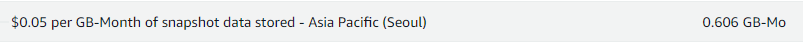

## RDS 관련 VPC 요금 문제

AWS는 프리티어에게 RDS도 특정 기기에 대해 무료로 제공하는데,  
요금이 발생했다.
(아주 조금)

이를 확인해보니, RDS는 무료로 제공하는게 맞지만, public으로 접근할 때는 요금이 발생한다고 한다.

> 2024/02 부터 요금 정책이 변했다고 한다.
> 
> 이전에는 모두 무료였는데, 2024/02부터 EC2의 public IPv4에 대해서만,  
> 무료로 제공한다고 한다.

### 해결 방법

RDS의 퍼블릭 액세스를 불가능으로 바꾸면 된다.

그런데 퍼블릭 액세스를 불가능으로 바꾸면, 외부(로컬)에서 RDS에 접속을 하지 못한다.

> 이때는, SSH 프로토콜로 EC2에 접속한 후,  
> EC2에서 RDS에 접속하면 된다.

---

## EC2 인스턴스 스냅샷 요금 문제

### 개요

EC2 스냅샷으로 인한 요금이 발생했다.

### 원인

EC2 인스턴스를 복제하기 위해 AMI를 생성했는데,  
AMI를 생성할 때 이에 대한 스냅샷도 생성된다고 한다.

> AMI vs 스냅샷
> 
> 스냅샷은 EC2에 연결되어 있는 EBS 볼륨을 백업하는 기능이다.
> 
> 만약 AMI를 생성할 때 해당 EC2에 대한 스냅샷이 없다면,  
> 스냅샷도 같이 생성된다.
> 
> (스냅샷을 이용해 AMI를 생성할 수 있다)

나중에 AMI를 삭제했지만, 수동으로 스냅샷을 삭제하지 않아서 문제가 발생했다.  
(AMI와 스냅샷을 둘 다 따로 삭제해야 되는 것 같다)

### 해결

스냅샷을 삭제함으로써 문제 해결