형식

#### ERROR, WARN 내용

`발생이유`:

`해결방법`:

---

#### 2023-08-06 18:47:12.758  WARN 2272 --- [l-1 housekeeper] com.zaxxer.hikari.pool.HikariPool        : HikariPool-1 - Thread starvation or clock leap detected (housekeeper delta=1m6s828ms665µs608ns).

`발생이유`: 클라이언트의 request를 스레드 풀에서 스레드를 할당받아서 서버를 돌려야 하는데,  스레드가 부족함

ec2 모니터링을 보니, 이때 CPU 가동률이 100% 가까이였음. cpu가 스왑하느라 바빠서 서버쪽 스레드풀에 스레드 전달을 못해줌

`해결방법`: cpu나 메모리 성능을 높여야지

---

#### 2023-08-06 18:49:18.985 ERROR 2272 --- [nio-8080-exec-1] o.a.c.c.C.[Tomcat].[localhost]           : Exception Processing ErrorPage[errorCode=0, location=/error]
#### org.apache.catalina.connector.ClientAbortException: java.io.IOException: Broken pipe

`발생이유`: Receiver 에서 송신 받은 데이터를 제때 처리하지 못하는 상황(네트워크가 느리거나 CPU 가 max 인 경우)에서 Sender 가 계속 보내는 경우 발생한다.

`해결방법`: request 후 response 기다리기, 그냥 exception 무시하기, 중복요청막기

---

#### 2023-08-06 19:24:28.655 ERROR 2272 --- [onnection adder] com.zaxxer.hikari.pool.HikariPool        : HikariPool-1 - Error thrown while acquiring connection from data source
#### com.mysql.cj.jdbc.exceptions.CommunicationsException: Communications link failure
#### The last packet successfully received from the server was 30,943 milliseconds ago. The last packet sent successfully to the server was 33,417 milliseconds ago.

`발생이유`: 일반적으로 데이터베이스에 대한 연결을 설정하거나 유지하는 데 문제가 있을 때

> DB를 잘못세팅했을때도 있지만, 대부분 네트워크 문제, 나는 ec2 인스턴스가 꺼져서 그런듯

`해결방법`: 네트워크 상태 잘 확인하고, 로깅 잘해야함

---

### 우분투에서 자바 버전 변경하는 방법

어쩔 수 없이 여러 버전의 자바를 사용해야 할 때가 있다.  
이때 default로 적용되는 자바 버전을 변경하는 방법을 알아보자.

/etc/alternatives/java로 가면, 현재 사용중인 자바 버전을 확인할 수 있다.  
(심볼릭 링크로 연결되어 있음)

`sudo update-alternatives --config java`  
위 명령어를 입력하면, 자바 버전을 선택할 수 있는 목록이 나온다.  
원하는 버전을 선택하면, 해당 버전으로 자바가 변경된다.

---

### 모니터링에서 warn 로그가 있었는데 몇 일 지나니까 안보인다.

모니터링에서 제공하는 warn 로그는 프로메테우스가 수집하는  
logback_events_total 메트릭이다.  

이 메트릭은, 스프링 프로그램이 시작했을 때부터 지금까지  
발생한 로그들의 개수를 반환한다.

문제는 프로그램을 다시 시작했을 때다.  
프로그램을 다시 시작하면, 이전의 로그 관련 메트릭이 없어지기 때문에,  
이 문제가 발생했던 것이다.

> 프로메테우스가 수집하는 logback 메트릭과  
> promtail이 loki에게 전달하는 로그와는 별개다.
> 
> 그리고 logback 설정을 통해 이전 날짜의 로그가 roll 되도,  
> 메트릭에는 영향이 없다.  
> (스프링 액츄에이터가 수집하는 데이터는 자체적으로 수집하는 것)

---

### 다음 warn, error 로그가 발생하지 않으면 날짜가 지나도, 예전 로그가 계속 현재 파일에 남아있다.

그러니까 날짜가 지나면 자동으로 roll 되는게 아니라,  
다음 날에 새로운 로그가 발생해야, 이전의 로그가 roll 된다.

---

## dev 서버의 스왑 영역 사용량이 테스트 서버에 비해 높다.

### 개요

성능테스트를 위해 dev 서버와 분리된 테스트 서버를 사용했다.

그리고 두 서버의 메트릭을 주기적으로 받아 모니터링하고 있는데,  
dev 서버의 스왑 영역 사용량이 테스트 서버에 비해 높았다.

(왼쪽이 dev 서버, 오른쪽이 test 서버)  
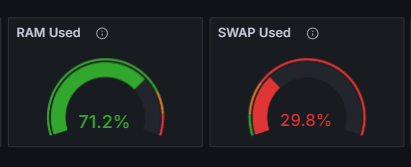
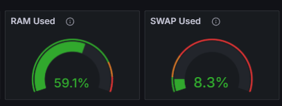

> 물론 dev 서버가 이것저것 설치한 프로그램이 많지만,  
> 위의 차이는 비이상적으로 느껴졌다.

### 원인

dev 서버와 test 서버의 스왑 영역을  
어떤 프로세스들이 사용하는지 확인하기 위해  
smem 명령어를 사용했다.

> smem: 프로세스 별로 메모리 사용량을 보여주는 명령어

`smem -s swap -r` 결과  
(왼쪽이 dev 서버, 오른쪽이 test 서버)  
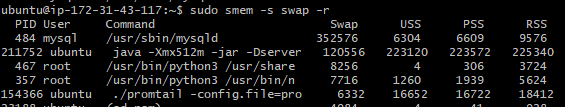
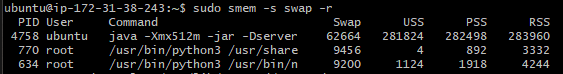

> -s swap : 스왑 영역 사용량 오름차순으로 정렬  
> -r : 결과를 뒤집어서 반환

결과를 보니, dev 서버의 스왑 영역을 많이 사용하는 프로세스는  
`mysqld` 프로세스였다.

> mysqld 프로세스가 스왑 영역을 많이 사용한 이유  
> 
> dev 서버 구성 초창기 AWS RDS를 사용하지 않고,  
> dev 서버에 mysql을 설치해서 사용했었다.
> 
> 그 이후에는 RDS를 사용하게 되었지만,  
> mysql 프로세스는 한번 실행되면,  
> 백그라운드에서 계속 실행되기 때문에  
> 메모리에 남지 않고 스왑 영역에 남아있었다.

### 해결

mysqld 프로세스를 kill 함으로써 해결했다.

mysqld 프로세스 kill 이후 결과

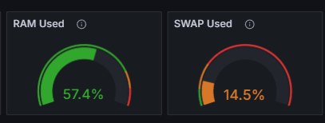

메모리 사용량은 약 15% 정도 감소했다.  
스왑 영역 사용량도 약 15% 정도 감소했다.

> 백그라운드에서 동작하는 mysqld 프로세스의 총 메모리 사용량  
> 
> dev 서버의 메모리 크기: 1GB  
> dev 서버의 스왑 영역 크기: 2GB
> 
> 메모리는 150MB 정도 감소했고,  
> 스왑 영역은 300MB 정도 감소했다.
> 
> -> 혼자 백그라운드에서 거의 500MB 정도 사용하고 있었다.

### 인사이트

우분투에서 명령어를 통해 전체 사용량 같은 것들을 확인할 때는,  
꼭 sudo를 붙여주자

처음에 sudo 없이 smem 명령어를 사용했다가,  
mysqld 프로세스를 확인하지 못해 애를 먹었다.

> 내가 ssh 로 접속했을 때는 ubuntu 사용자로 로그인 헀는데,  
> mysqld 프로세스의 사용자는 mysqld이기 때문에  
> sudo 없이는 확인할 수 없었다.

---

## EC2 인스턴스의 AMI 생성 관련 문제

### 개요

스프링의 로그 파일을 추적하기 위해 promtail & loki를 이용하고 있다.

이때 EC2 인스턴스를 옮기기 위해 AMI를 이용했는데,  
옮기고 나서 다시 loki를 실행했을 때 이전 로그들이 사라졌다.

### 원인

loki-config.yaml 파일을 통해 loki의 설정을 관리하고 있었는데,  
loki가 로그를 저장하는 위치가 문제였다.

```yaml
common:
  storage:
    filesystem:
      chunks_directory: /tmp/loki/chunks
```

위 코드를 보면 loki는 `/tmp/loki/chunks` 디렉토리에 로그들을 저장하고 있었다.

이때 EC2 인스턴스의 AMI를 생성할 때 `/tmp` 디렉토리를 포함하지 않는다.

> `/tmp` 디렉토리는 임시 파일을 저장하는 용도로 사용되며,  
> 시스템 재부팅 or AMI 생성 시 그 내용이 유지되지 않는다.

이로 인해 이전의 로그가 전부 사라졌던 것이었다.

### 해결

일단 이전의 EC2 인스턴스는 이미 중지시켰기 때문에,  
이전의 로그들을 복원할 수는 없을 것 같다.

나중에 이런 문제를 방지하기 위해  
loki가 로그들을 `/tmp`의 하위 디렉토리가 아닌 다른 디렉토리에 저장하는 것이 좋을 것 같다.  
(`/var/loki` 등)

### 인사이트 (Optional)

이 문제를 통해, 각 디렉토리가 어떻게 유지되는지 체감할 수 있었다.  
나중에 중요한 시스템 로그가 날라가는 것을 방지하기 위해  
어떤 디렉토리에 어떤 파일을 저장하는지 잘 관리해야겠다.

---

## dev 서버에 아무짓도 하지 않았는데, 메모리 & 스왑 영역 사용량이 높아졌다.

### 개요

그냥 자고 일어났더니, 메모리 & 스왑 영역 사용량이 높아졌다.

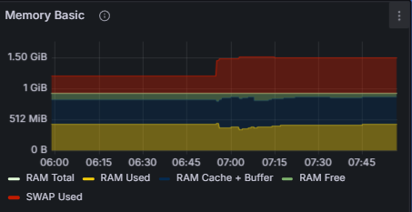

### 원인

EC2에서 직접 메모리 & 스왑 영역 사용량을 확인해보니 알 수 있었다.

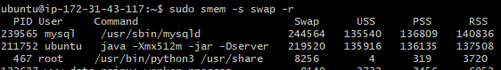

mysqld가 메모리 & 스왑 영역을 많이 사용하고 있었다.

나는 이 프로세스를 실행시킨 적이 없는데,  
mysqld 프로세스가 자동으로 실행 되었던 것이다.

### 해결

이와 관련된 자료를 찾아보니 mysqld는  
자동으로 실행 될 수 있는 프로세스 중 하나였다.

> systemd를 사용하는 서비스가 자동 실행이 되는지 확인하는 명령어  
> `sudo systemctl is-enabled {service_name}`

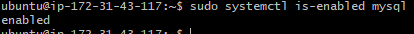

위 사진처럼  
`mysql.service`가 `enabled`로 되어있었다.

> 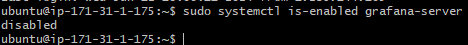
> 
> 이렇게 disabled로 되어 있다면,  
> 해당 서비스는 자동으로 실행되지 않는다.

`sudo systemctl disable mysql` 명령어를 통해  
mysqld 서비스의 자동 실행을 막았다.

그리고 현재 실행 중인 mysqld 서비스를 stop 했다.

이후 메모리 & 스왑 영역 상황  

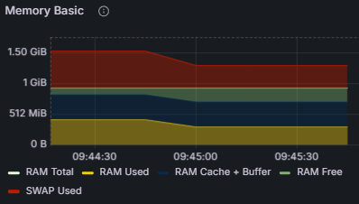

> 여기서 나는 mysqld 서비스를 아예 사용하지 않기 때문에,  
> mysqld 서비스를 완전히 삭제했다.  
> (현재 RDS를 사용하고 있기 때문에)

---

## 탄력적 IP와 pem 키는 그대로 사용했는데, ssh 연결이 안될 때

### 개요

기존 인스턴스를 그대로 복사하기 위해 AMI를 이용했다.

AMI를 이용해 ec2를 새로 생성하고, 탄력적 IP를 다시 연결했을 떄,  
SSH 요청을 했을 떄 실패했다.

> IP 주소, pem 키, 사용자 이름 모두 같은 상태

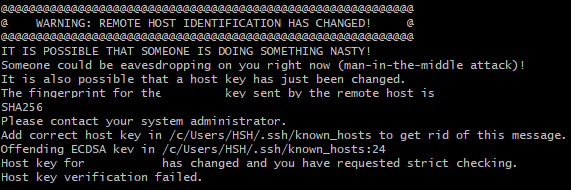

### 원인

위 문제는 EC2 인스턴스는 변경되어서 ssh key가 변경되었기 때문이다.  
(현재 내 컴퓨터에는 기존의 ssh key가 남아있는 상태)

### 해결

이떄 아래 명령어를 사용해주면 된다.

`ssh-keygen -R {IP Address}`

를 이용해 기존의 ssh key를 삭제하고, 다시 연결하면 된다.

EC2 인스턴스의 스왑 영역 사용량이 높아졌다.

---

## EC2에서 실행 중인 스프링 서버의 TPS가 갑자기 떨어졌다.

### 개요

AWS EC2 위에서 실행 중인 스프링 서버에 부하 테스트를 진행했다.  
(개발 서버가 아닌 테스트 서버)

테스트를 진행하던 중, TPS가 갑자기 떨어졌다.  
(약 300 TPS -> 10 TPS)

// todo nGrinder 결과 이미지

### 원인 - 1 TPS가 떨어진 이유

일단 그라파나를 통해 메트릭들을 확인해보니,  
CPU 관련 메트릭 중 steal mode의 점유율이 높아졌다.  
(0% -> 90%)

// todo 그라파나 이미지

> `CPU Steal Time`  
> 하이퍼바이저가 다른 가상 프로세서를 서비스하는 동안 가상 CPU가 실제 CPU를 기다리는 시간을 백분율로 표시한 값

> 하이퍼바이저란 가상화를 제공하는 소프트웨어를 말한다.
> 
> 가상 환경에서 동작하는 VM(Virtual Machine)은 단일 호스트에 있는 다른 인스턴스와 리소스를 공유한다.  
> CPU Steal Time을 통해 VM에서 동작하는 CPU가 물리 머신으로부터 자원을 할당받기 위해 얼마나 대기하고 있는지 알 수 있다.

현재 스프링 서버는 EC2 인스턴스 위에서 동작하고 있기 때문에,  
하이퍼바이저가 다른 가상 프로세서를 서비스하는 동안 가상 CPU가 실제 CPU를 기다리는 시간이 늘어나면서,  
TPS가 갑자기 떨어진 것이다.

### 원인 - 2 steal time이 높아진 이유

steal time은 EC2와 관련있는 메트릭이기 때문에,  
클라우드 워치를 통해 EC2 관련 인스턴스를 확인해봤다.

클라우드 워치를 통해 확인해보니,  
현재 EC2의 CPU Credit Balance가 0으로 떨어져 있었다.

> Credit Balance가 떨어진 시점과 steal time이 높아진 시점이 일치했다.

> `CPU Credit Balance`  
> CPU Credit Balance는 CPU Credit의 총량을 나타낸다.  
> CPU Credit은 CPU 사용량이 낮을 때 발생하는 Credit이다.

### 원인 - 3 CPU Credit이 떨어진 이유

CPU Credit이 떨어진 이유는,  
연속적인 부하 테스트로 인해 CPU 사용량이 높아져서,  
CPU Credit이 고갈된 것이다.

> CPU Credit은 유한한 양이기 때문에,  
> CPU Credit이 떨어지면 steal time이 높아지고,  
> TPS가 갑자기 떨어지는 현상이 발생한다.

// todo cpu credit 관련 EC2 동작 과정 설명 추가

### 해결

TPS가 떨어진 원인은 제대로 파악했다.  

이 문제는 EC2 CPU의 과도한 사용으로 인해 발생한 것이기 때문에,  
CPU Credit이 떨어지지 않도록 관리해야 한다.

많은 부하가 발생해도 CPU 점유율이 높아지지 않도록  
세팅을 조정해야 한다.

