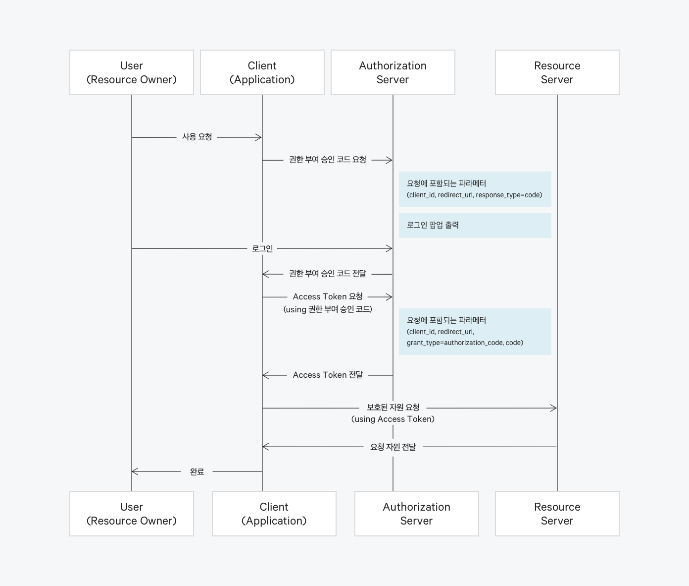
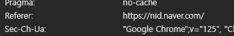

## 테스트 서버에서 OAuth2 인증이 실패한다.

### 개요

기존 dev 서버가 있고 이를 테스트 해보기 위해  
별도의 테스트 서버를 설치해 여기서 OAuth2 로그인을 진행했는데,  
로그인 실패했다.

정확히는 구글 로그인까지는 성공하고,  
그 다음 인가 토큰을 서버에 전달하는 요청에서  
에러 응답이 왔다.

### 원인

이는 구글에서의 인증을 성공하고,  
(Authorization 서버)  

권한 부여 승인 코드를 API 서버로 요청했을 때,  
이 url이 테스트 서버가 아닌 dev 서버로 요청됐기 때문이다.

### 해결

해당 url을 테스트 서버 url로 고치면 된다.

> 이때 해당 url을 각각의 Authorization 서버에 등록해줘야 한다.

### 인사이트 (Optional)

이 문제를 통해 OAuth2 인증 프로세스를 어느정도 이해했다.

처음에 위 사진을 보고 User가 로그인 한 후에,  
Authorization 서버가 권한 부여 승인 코드를 바로 Application에게 전달하는 줄 알았지만,  
사실 이건 리다이렉트를 통해 User를 거친 후에 Application에 도착하는 것을 알게 됐다.

> 여기서 구글과 카카오는 302 응답을 통해 User를 거치는 것을 확인했지만,  
> 네이버는 302 응답이 보이지 않았다.  
> (그래도 결과는 같다)
> 
>   
>   
> (위 사진은 네이버 요청으로 쿼리 파라미터에 리다이렉트 uri를 전달하는 사진)  
> (아래 사진은 uri 요청에 Referer 헤더로 nid.naver.com 사이트가 입력돼 있는 사진)
>
> 위 사진을 보면 User가 Application에게 권한 부여 승인 코드를 보내는 요청에  
> Referer 헤더가 들어 있는 것을 확인했다.  
> 
> 따라서 네이버는 302 응답으로 url에 요청하는 것이 아니라,  
> 따로 처리를 해서 url에 요청을 하는 것으로 보인다.

