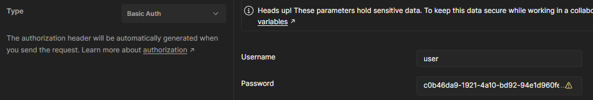

## 1. 스프링 시큐리티의 전체적인 인증 과정


// TODO 정확한 이미지로 교체

1. AuthenticationFilter가 request를 받음
2. 받은 request에 있는 username/password를 이용해 UsernamePasswordAuthenticationToken 생성
3. Token을 AuthenticationManager에게 보내면서 인증 진행 (대표적인 구현 객체는 ProviderManager)
4. ProviderManager는 현재 Token을 인증을 할 수 있는 AuthenticationProvider를 search & 해당 Provider에게 Token 보냄
5. 해당 Provider는 UserDetailsService에게 Token에 있는 username으로 DB 조회 요청
6. UserDetailsService는 username를 통해 DB로부터 사용자 정보를 조회한다. & 해당 사용자 정보로 UserDetails 생성
7. AuthenticationProvider는 UserDetailsService로부터 받은 UserDetails를 통해 사용자 인증 진행
8. 인증 성공하면 해당 사용자 정보 객체(Authentication 객체)를 AuthenticationManager로 반환
9. Authentication 객체 AuthenticationFilter로 반환
10. 받은 Authentication 객체를 SecurityContext에 저장

> SecurityContext에 있는 Authentication을 이용해서 권한 인증(인가)를 진행한다.

> AuthenticationFilter는 interface가 아니라 인증을 진행하는 필터를 의미한다.
> UsernamePasswordAuthenticationFilter, BasicAuthenticationFilter가 이에 해당한다.

AuthenticationFIlter를 통해 인증하는 방법은 여러가지가 있다.
1. Basic 인증 - BasicAuthenticationFilter
2. Form 인증 - UsernamePasswordAuthenticationFilter
3. 다이제스트 인증
> 다이제스트는 다른 두가지 방식에 비해 거의 사용되지 않되므로 다루지 않겠음

---

### 1-1 Form 인증
> SecurityConfig에서 formLogin()을 통해 설정할 수 있습니다.

Form 로그인은 HTML Form을 통해 제공된 username과 password를 읽어서 인증을 진행합니다.

```UsernamePasswordAuthenticationFilter```가 Form 로그인을 지원합니다.

클라이언트가 Form 로그인 요청을 보냈을 때,
```UsernamePasswordAuthenticationFilter```가 Form 로그인을 통해 인증하는 과정은 다음과 같습니다.

> Spring Security에서 아무것도 건드리지 않은, default 설정일때 기준입니다.

1. 클라이언트가 HTML Form에 username과 password를 입력하고 서버로 데이터를 제출합니다.

> url은 /login이고, http method는 POST입니다.  
> HttpServletRequest의 request body는 username=아무이름password=아무비밀번호 형태로 제출됩니다.

2. Spring Security에 의해 Servlet Filter로 등록된, ```UsernamePasswordAuthenticationFilter```가 이 url(/login)과 method(POST)를 감지하고, request body에 있는 username과 password를 이용해서 UsernamePasswordAuthenticationToken을 생성합니다.

3. 생성한 UsernamePasswordAuthenticationToken을 AuthenticationManager에게 보냅니다.

> AuthenticationManager의 authenticate 메서드 호출

4. 인증이 성공됐다면 성공된 토큰을 SecurityContextHolder에 저장합니다.

---

### 1-2 Basic 인증
> SecurityConfig에서 httpBasic()을 통해 설정한다.

클라이언트는 Authorization 헤더에 Base64로 인코딩된 username/password 값을 입력하고 request를 보낸다

> 예시1 - POSTMAN
>
> 
> 

> 예시2 - 크롬
> 
> 

> request
> 
> 

클라이언트의 request에서 Authorization 헤더를 찾아서, 해당 값을 디코딩 진행 

-> request의 헤더로부터 username/password를 추출한다.

-> username/password를 이용해 UsernamePasswordAuthenticationToken 생성

-> UsernamePasswordTokenAuthenticationManager의 authenticate 메서드를 호출한다. (Token도 같이 보낸다)

> 만약 헤더가 없다면 response에 WWW-Authenticate 헤더를 담아서 클라이언트에게 보낸다 
> 
> 

### 1-3 AntityManger의 authenticate 메서드

AuthenticationManager는 interface이다.

스프링 시큐리티에서 다른 설정을 하지 않았다면 기본적으로 ProviderManager가 구현 객체로 주입된다.

그리고 ProviderManager는 인증을 위해 AuthenticationProvider의 authenticate 메서드를 호출한다.

AuthenticationProvider는 역시 interface이다.

스프링 시큐리티에서 다른 설정을 하지 않았다면 기본적으로 DaoAuthenticationProvider가 구현 객체로 주입된다.

그리고 DaoAuthenticationProvider는 인증하는 중간에 UserDetailsService의 loadUserByUsername 메서드를 호출한다.

해당 메서드를 통해 입력받은 username에 해당하는 사용자가 DB에 있는지 조회한다.

없다면 Exception 호출

username에 해당하는 사용자가 DB에 있다면, 해당 사용자 정보와 password를 비교해서 인증을 진행한다.

인증에 성공하면 마지막으로 AuthenticationFilter에서 SecurityContext에 Authentication을 set한다.

전체적인 과정


위의 사진과 비교하면, 여기서 AuthenticationFilter는 UsernamePasswordAuthenticationFilter가 된다. 