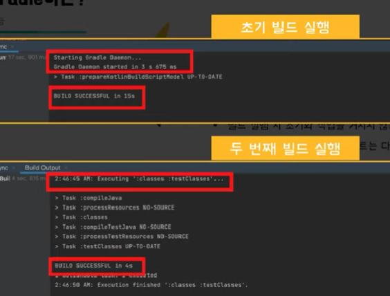

## Gradle

인텔리제이로 스프링 부트 프로젝트를 하면, 대부분 gradle을 사용한다.

나 역시 gradle을 사용하지만, gradle이 정확히 어떤 역할을 하는지는 모르고 사용했다.

---

### Gradle이란

2012년에 출시된 Groovy를 기반으로 한 오픈소스 빌드 도구로, 거의 모든 타입의 소프트웨어를 빌드할 수 있는 빌드 자동화 시스템

> 빌드 - 소스 코드를 컴파일, 테스트, 정적 분석 등을 실행하여 실행 가능한 애플리케이션으로 만들어주는 과정

---

다양한 라이브러리가 등장하면서, 개발자 혼자서 이 라이브러리들을 관리하는 것은 어렵다.

문제점
1. 라이브러리를 다운로드 및 추가하는 번거로움
2. 개발자들 간의 버전관리 어려움
3. 다운받은 jar 파일의 보안 위험

---

### 빌드 도구

이런 문제를 한번에 해결할 수 있는 도구가 바로 `빌드 도구`이다.

빌드 도구는
1. 계속해서 늘어나는 라이브러리를 자동 추가 및 관리해준다
2. 프로젝트를 진행하며 라이브러리의 버전을 쉽게 동기화해준다

> Groovy - JVM 상에서 실행되는 스크립트 언어, Java와 유사한 문법 구조를 가지며, 호환성이 좋다.
>
> Gradle은 Groovy를 기반으로 하고 있기 때문에, 자바 개발자들에게 유용하다

---

### Gradle의 장점

1. 프로젝트를 설정 주입(Configuration Injection) 방식으로 정의
2. 멀티 프로젝트 빌드
3. 빌드 속도가 빠름

> 멀티 프로젝트 빌드
> 
> 하나의 Repository 내에 여러 개의 하위 프로젝트를 구성할 수 있다.<br>
> 하나의 모듈로 하면 많은 코드를 복붙해서 구현해야 하지만, gradle을 사용하면 다음과 같은 중복을 피할 수 있다.

> 빌드 속도가 빠른 이유
>
> 1. 점진적 빌드 - gradle은 빌드 실행 중 마지막 빌드 호출 이후에 task의 입력, 출력 혹은 구현이 변경되었는지 확인한다 & 최신 상태로 간주하지 않는다면 빌드는 실행되지 않는다.
> 2. 빌드 캐시 - 두 개 이상의 빌드가 돌아가고, 하나의 빌드에서 사용되는 파일들이 다른 빌드들에 사용된다면 gradle은 빌드 캐시를 이용해 이전 빌드의 결과물을 다른 빌드에서 사용할 수 있다.(다시 빌드하지 않아도 되서 시간이 줄어듬)
> 3. 데몬 프로세스(서비스의 요청에 응답하기 위해 오래 동안 살아있는 프로세스) - gradle의 데몬 프로세스는 메모리 상에 빌드 결과물을 보관 -> 한 번 빌드된 플젝트는 다음 빌드에서 매우 적은 시간만 소요된다.


---

### Gradle의 활용

```
plugins {

}

repositories {
    mavenCentral()
}

dependencies{
    implementation ...
    compileOnly ...

    testImplementation ...

    runtimeOnly ...

}
```

1. plugins
특정 작업을 위해 모아놓은 task들의 묶음

(dependency에서 자주 쓰는 애들을 task들의 묶음으로 만든다)


2. dependencies
프로젝트에서 사용하는 라이브러리나 패키지를 `의존성`이라고 한다.

프로젝트별로 어떤 의존성을 갖는지 명시해주어야 한다.

이떄 특정 시점에만 라이브러리를 추가할 수 있다.

(특정 시점외에 라이브러리가 있으면, 이는 리소스 낭비이기 때문)

```api``` - 내부 의존성을 컴파일과 런타임 모두에 보이는 API 의존성

```implementation``` - 내부 의존성을 런타임에서만 보이는 구현 의존성

```compileOnly``` - 컴파일에만 사용되는 의존성 정의

```runtimeOnly``` - 런타임에만 사용되는 의존성 정의

test + Inplementation, CompileOnly, RuntimeOnly - 해당 의존성을 테스트 시에만 사용하도록 정의

3. repositories

dependency에서 사용한다고 추가했던 라이브러리가 저장된 위치를 정의한다.

대표적으로 mavenCentral()이 있다

라이브러리의 저장소를 명시해주면 Gradle이 해당 저장소에서 필요한 라이브러리를 가져온다.