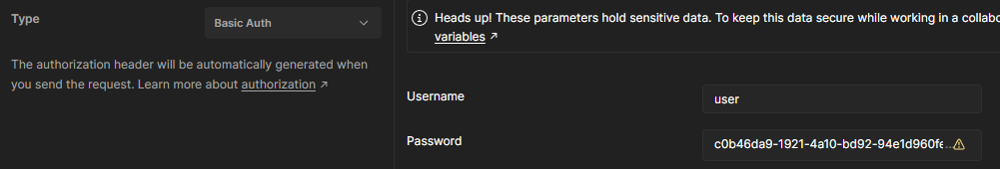
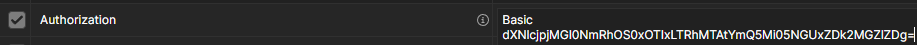

# Spring Security

**목차**
1. 스프링 시큐리티 전체적인 과정
2. 기본적인 인증 과정(form 로그인 & basic 로그인 & AuthenticationManger.authenticate 메소드)
3. Authentication Architecture (유저 인증될때 사용되는 클래스의 구조)
4. SessionManagementFilter
5. ExceptionTranslationFilter가 인증 & 인가 관련 Exception을 처리하는 과정 ( +AnonymousAuthenticationFilter )
6. FilterSecurityInterceptor ( 권한 인증을 처리하는 필터 )
7. (Appendix) 기존 세션방식에서 jwt로 바꾸는 과정 
8. (Appendix) 로그인된 유저정보를 가져오기 ( @AuthenticationPrincipal )

---

## 1. 스프링 시큐리티 전체적인 과정

스프링 시큐리티는 필터를 이용해서 인증, 인가를 처리한다.

---

## 2. 기본적인 인증 과정(form 로그인 & basic 로그인 & AuthenticationManger.authenticate 메소드)

클라이언트로부터 username/password를 받아서 AuthenticationManager의 authenticate 메소드를 통해 인증을 진행한다.

이때 username/password를 받는 방식이 여러가지가 있다
1. Basic 인증
2. Form 인증
3. 다이제스트 인증
> 다이제스트는 다른 두가지 방식에 비해 거의 사용되지 않되므로 다루지 않겠음

---

### Form 인증
> SecurityConfig에서 formLogin()을 통해 설정한다.

// TODO

---

### Basic 인증
> SecurityConfig에서 httpBasic()을 통해 설정한다.

클라이언트는 Authorization 헤더에 Base64로 인코딩된 username/password 값을 입력하고 request를 보낸다

> 예시1 - POSTMAN
>
> 
> 

> 예시2 - 크롬
> 
> 

> request
> 
> 

클라이언트의 request에서 Authorization 헤더를 찾아서, 해당 값을 디코딩 진행 

-> username/password를 추출해서 AuthenticationManager의 authenticate 메서드를 호출한다.

> 만약 헤더가 없다면 response에 WWW-Authenticate 헤더를 담아서 클라이언트에게 보낸다 
> 
> 

### AntityManger의 authenticate 메서드

AuthenticationManager는 interface이다.

스프링 시큐리티에서 다른 설정을 하지 않았다면 기본적으로 ProviderManager가 구현 객체로 주입된다.

그리고 ProviderManager는 인증을 위해 AuthenticationProvider의 authenticate 메서드를 호출한다.

AuthenticationProvider는 역시 interface이다.

스프링 시큐리티에서 다른 설정을 하지 않았다면 기본적으로 DaoAuthenticationProvider가 구현 객체로 주입된다.

그리고 DaoAuthenticationProvider는 인증하는 중간에 UserDetailsService의 loadUserByUsername 메서드를 호출한다.

해당 메서드를 통해 입력받은 username이 DB에 있는지 조회한다.
없다면 Exception 호출

// TODO 비밀번호 체크하는 메서드

// TODO 실제 코드 사진 

---

## 3. Authentication Architecture (유저 인증될때 사용되는 클래스의 구조)

---

## 4. SessionManagementFilter

---

## 5. ExceptionTranslationFilter가 인증 & 인가 거부를 처리하는 과정 ( +AnonymousAuthenticationFilter )

---

## 6. FilterSecurityInterceptor

---

## 7. (Appendix) 기존 세션방식에서 jwt로 바꾸는 과정

---

## 8. (Appendix) 로그인된 유저정보를 가져오기 ( @AuthenticationPrincipal )

---

로그인을 할때 parent로 왜 다시 try하는 거지?