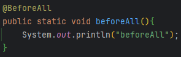
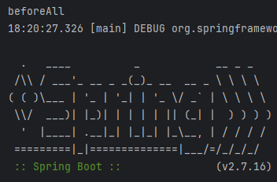

# Before{Each, All, Transaction} & After annotation

테스트 메서드를 실행하기 전 & 후에 해야 할 작업들이 있다.  
이때 필요한 메서드를 지정하기 위한 어노테이션들이 @Before{Each, All, Transaction} & @After{Each, All, Transaction} 이다.

> 간단히 말하면 Before은 메서드 실행 전에 실행되는 것, After은 메서드 실행 후에 실행되는 메서드를 지정해주는 어노테이션이다.  
(After 어노테이션은 Before의 반대이기 때문에 굳이 설명하지 않겠다)

## @BeforeAll

모든 메서드가 실행되기 전에 `딱 1번` 실행되는 메서드를 지정하는 어노테이션이다.  

해당 메서드는 `스프링 컨테이너가 등록되기 전(& 스프링 빈이 등록되기 전)`에 실행되기 때문에, 스프링 빈 관련 작업이 아닌,  
`모든 테스트에 한 번만 로딩되어야 하는 데이터를 로딩할 때, 혹은 테스트에 설정된 불변값이 로딩되어야 하는 경우` 사용된다.

  
  
(위 사진처럼, 스프링 컨테이너가 등록되기 전에 @BeforeAll로 설정한 메서드가 실행된다)

## @BeforeTransaction

`각 메서드의 트랜잭션이 시작하기 전`에 실행되는 메서드를 지정하는 어노테이션이다.

이 어노테이션이 적용된 메서드는 트랜잭션이 시작하기 전에 실행되기 때문에, 트랜잭션과 관련없는 값들을 세팅할 때 사용된다.

## @BeforeEach

`각 메서드의 트랜잭션이 시작되고, 코드를 실행하기 전`에 실행되는 메서드를 지정하는 어노테이션이다.

트랜잭션이 시작하고 나서 실행되기 때문에, 트랜잭션과 관련있는 선행 작업을 해줘야 할 때 사용된다.