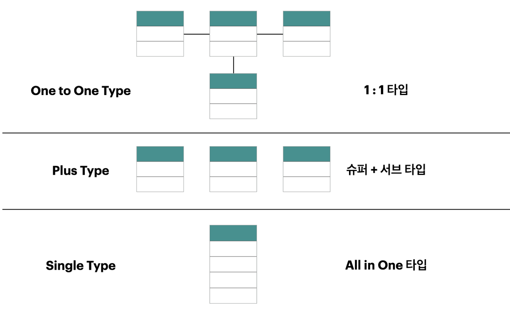

### 정규화 과정

정규화 과정은 릴레이션 간의 잘못된 종속 관계로 인해 DB 이상 현상이 일어나서 이를 해결하거나, 저장 공간을 효율적으로 사용하기 위해 릴레이션을 여러 개로 분리하는 과정입니다.

정규화된 정도는 정규형(NF, Normal Form)으로 표현한다.

|정규형|의미|
|--|--|
|1NF|모든 attribute의 값은 atomic해야 한다.|
|2NF|부분종속함수제거(non-prime attribute는 key를 partial FD 하면 안됨)|
|--|(다른표현)후보키의 진부분집합으로는 함수적종속성을 만족x|
|3NF|이행종속함수제거(non-prime attribute끼리 FD하면 안됨)|
|--|(다른표현) trivial or a '전부'가 슈퍼키여야 한다 or a에는 없고 b에는 있는 attribute중 하나가 후보키에 소속되야 한다|
|BCNF|모든 non-prime attribute는 X에 오면 안됨|
|--|(다른표현) trivial or a '전부'가 슈퍼키여야 한다|

(모든 정규화는 앞의 정규화를 만족해야한다)

(BCNF와 종속성 보존을 둘다 만족하지 못할수있다)

> 정규형 과정을 거친다고 성능이 100% 좋아지는 것은 아님
>
> 좋아질수도 나빠질수도 있음 
>
> 테이블을 나누게 되면 어떤 쿼리는 조인을 해야해서 느려질수 있다 -> 이때는 반정규화 필요

---

#### 반정규화(Denormalization)

시스템의 성능 향상, 개발 및 운영의 편의성 등을 위해 정규화된 데이터 모델을 통합, 중복, 분리하는 과정으로 의도적으로 정규화 원칙을 위배하는 행위

반정규화를 수행하면 시스템의 성능이 향상되고 관리 효율성을 증가시키지만 데이터의 일관성 및 정합성이 저하될 수 있다.

`반정규화의 대상`
- 디스크 I/O량이 많아 성능저하
- 경로가 너무 멀어 조인으로 성능저하
- 컬럼을 계산하여 읽을 때 성능 저하

> 반정규화를 위해서는 사전에 데이터의 일관성과 무결성을 우선으로 할지, DB의 성능과 단순화를 우선으로 할지를 결정해야 함

`다른 방법 유도 검토`
- 뷰(VIEW) 사용 : 지나치게 많은 조인(JOIN)이 걸려 데이터를 조회하는 작업이 기술적으로 어려울 경우, 조회의 성능을 향상시키진 않음
- 클러스터링 : 대량의 데이터처리나 부분처리에 의해 성능이 저하되는 경우에 클러스터링을 적용하거나 인덱스를 조정함으로써 성능을 향상
- 파티셔닝 : 대량의 데이터는 Primary Key의 성격에 따라 부분적인 테이블로 분리(Partitioning)할 수 있음, 파티셔닝 Key에 의해 물리적인 저장공간이 구분
- 캐쉬 : 응용 애플리케이션에서 로직을 구사하는 방법을 변경

`반정규화 방법`

테이블 병합, 테이블 분할, 중복 테이블 추가, 중복 속성 추가 등이 있다.

|기법분류|기법|내용|
|--|--|--|
|테이블 병합|1:1 관계|1:1 관계를 통합하여 성능향상|
|--|1:M 관계|1:M 관계를 통합하여 성능향상|
|--|슈퍼/서브타입|슈퍼/서브 관계를 통합하여 성능 향상|
|테이블 분할|수직분할|컬럼 단위의 테이블을 디스크 I/O를 분산처리하기 위해 테이블을 1:1로 분리하여 성능향상(트랜잭션의 처리되는 유형파악이 선행되어야 함)|
|--|수평분할|행(레코드)단위로 집중 발생되는 트랜잭션을 분석하여 디스크 I/O 및 데이터 접근의 효율성을 높여 성능을 향상하기 위해 행 단위로 테이블을 쪼갬|
|테이블 추가|중복테이블 추가|다른 업무이거나 서버가 다른 경우 동일한 테이블 구조를 중복하여 원격 조인을 제거하고 성능을 향상|
|--|통계테이블 추가|SUM, AVG 등을 미리 수행하여 계산해 둠으로써 조회 시 성능을 향상|
|--|이력테이블 추가|이력테이블 중에서 마스터 테이블에 존재하는 레코드를 중복하여 이력 테이블에 존재하는 방법|

---

### 대량 데이터에 따른 성능
`컬럼이 많아짐에 따라 성능이 저하되는 유형`

로우 체이닝(Row Chaining) : 로우 길이가 너무 길어서 데이터 블록 하나에 데이터가 모두 저장되지 않고 두 개 이상 의 블록에 걸쳐 하나의 로우가 저장되어 있는 형태

로우 마이그레이션(Row Migration) : 데이터 블록에서 수정이 발생하면 수정된 데이터를 해당 데이터 블록에서 저장하지 못하고 다른 블록의 빈 공간을 찾아 저장하는 방식 
⇒ 트랜잭션을 분석하여 적절하게 1:1 관계로 분리함으로써 성능향상이 가능하도록 해야함

`PK에 의해 테이블을 분할하는 방법 (파티셔닝)`

Range Partition 
대상 테이블이 날짜 또는 숫자값으로 분리가 가능하고 각 영역별로 트랜잭션이 분리되는 경우 
ex) 요금 테이블 → 요금_0401, 요금_0402, etc.

Hash Partition 
지정된 HASH 조건에 따라 해슁 알고리즘이 적용되어 테이블이 분리됨

List Partition 
지점, 사업소, 사업장, 핵심적인 코드값 등으로 PK가 구성되어 있고 대량의 데이터가 있는 테이블이라면 값 각각에 의해 파티셔닝 
ex) 고객 테이블 → 고객_서울, 고객_경기, etc.

`테이블에 대한 수평/수직분할의 절차`
- 데이터 모델링을 완성
- 데이터베이스 용량산정
- 대량 데이터가 처리되는 테이블에 대해서 트랜잭션 처리 패턴을 분석
- 칼럼 단위로 집중화된 처리가 발생하는지, 로우단위로 집중화된 처리가 발생되는지 분석하여 집중화된 단위로 테이블을 분리하는 것을 검토

---

### 데이터베이스의 구조와 성능

`슈퍼타입과 서브타입`

슈퍼타입: 여러 엔티티가 공유하는 일반적인 카테고리 또는 공통 속성

서브타입: 슈퍼타입을 제외한 고유한 추가 속성

(논리적 데이터 모델에서 사용, 분석단계에서 사용)

`슈퍼/서브 타입 데이터 모델의 변환 기술`

|구분|OneToOne Type|Plus Type|Single Type|
|--|--|--|--|
|의미|각각의 테이블을 개별적으로 유지|서브타입별로 슈퍼타입 추가|모든 필드를 한 테이블에 추가|
|특징|개별 테이블 유지|슈퍼+서브타입 테이블|하나의 테이블|
|확장성|우수함|보통|나쁨|
|조인성능|나쁨|나쁨|우수함|
|I/O량 성능|좋음|좋음|나쁨|
|관리용이성|좋지않음|좋지않음|좋음(1개)|
|트랜잭션 유형에 따른 선택방법|개별 테이블로 접근이 많은 경우 선택|슈퍼+서브 형식으로 데이터를 처리하는 경우 선택|전체를 일괄적으로 처리하는 경우 선택|

---

### 분산 데이터베이스와 성능
`분산 데이터베이스`

여러 곳으로 분산되어있는 데이터베이스를 하나의 가상 시스템으로 사용할 수 있도록 한 데이터베이스

논리적으로 동일한 시스템에 속하지만, 컴퓨터 네트워크를 통해 물리적으로 분산되어 있는 데이터들의 모임.

`분산 데이터베이스가 되기 위한 6가지 투명성`

위치 투명성 : 사용하려는 데이터의 저장 장소 명시 불필요. 위치정보가 System Catalog에 유지되어야 함

중복 투명성 : DB 객체가 여러 site에 중복 되어 있는지 알 필요가 없는 성질
병행 투명성 : 다수 Transaction 동시 수행시 결과의 일관성 유지, Time Stamp, 분산 2단계 Locking을 이용 구현

분할 투명성(단편화) : 하나의 논리적 Relation이 여러 단편으로 분할되어 각 단편의 사본이 여러 site에 저장

장애 투명성 : 구성요소(DBMS, Computer)의 장애에 무관한 Transaction의 원자성 유지

지역사상 투명성 : 지역DBMS와 물리적 DB사이의 Mapping 보장. 각 지역시스템 이름과 무관한 이름 사용 가능

    분산데이터베이스는 데이터의 무결성을 완전히 보장하는 것이 불가능하다.