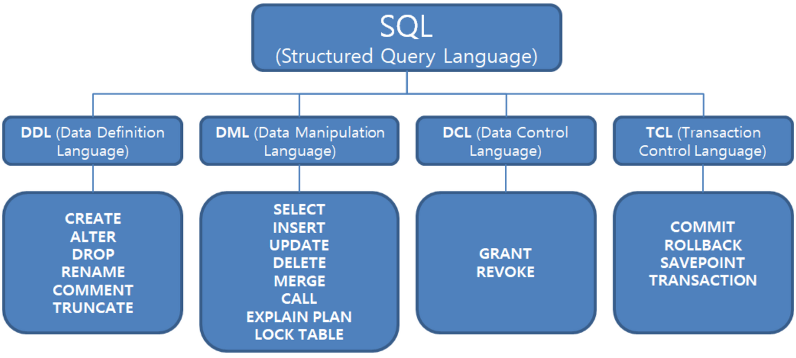

# SQL(Structed Query Language)

sql이란 데이터를 관리하기 위해 설계된 특수 목적의 프로그래밍 언어이다.

---

## DDL(Data Definition Language, 데이터 정의어) - Auto Commit

DB 구조 또는 스키마를 정의하는데 사용

> 주의: 직접 DB의 테이블에 영향을 미치기 때문에 DDL 명령어를 입력하는 순간,  
> 명령어에 해당하는 작업이 `즉시 커밋`된다는것을 기억하자

`CREATE` - 데이터베이스의 객체를 생성

※SCHEMA, DOMAIN, TABLE, VIEW, INDEX를 정의하거나 변경 또는 삭제할 때 사용하는 언어

※데이터 베이스 관리자나 데이터베이스 설계자가 사용

👉 CREATE 규칙

- 객체를 의미하는 것이므로 단수형으로 이름을 짓는걸 권고한다.
- 유일한 이름으로 명명해야 한다.
- 테이블 내의 컬럼명 또한 중복되지 않는 유일한 이름으로 명명해야 한다.
- 정의할 때 각 컬럼은 ,으로 구분하며 테이블 생성문의 마지막은 ;이다.
- 컬럼명은 데이터 표준화 관점에서 일관성 있게 사용해야 한다.
- 컬럼 뒤에 데이터 유형을 반드시 지정해야 한다.
- 테이블과 컬럼명은 반드시 문자로 시작한다.
- 대소문자 구분을 하지 않지만, 기본적으로 대문자로 만들어진다.

    CREATE TABLE 테이블이름 (
        필드이름1 필드타입1,
        필드이름2 필드타입2,
    )

    제약조건 - NOT NULL, UNIQUE, PRIMARY KEY, FOREIGN KEY, DEFAULT 기본값

    default를 설정해도 직접 null을 넣으면 null이 들어가네

`ALTER` - 데이터베이스의 구조를 변경

👉 ALTER: 컬럼 변경 문법

|명령어|내용|
|--|--|
|ADD COLUMN|컬럼을 추가하는 역할|
|DROP COLUMN|컬럼을 삭제하는 역할|
|MODIFY COLUMN|컬럼을 수정하는 역할|
|RENAME COLUMN|컬럼 이름을 변경하는 역할|
|DROP CONSTRAINT|컬럼을 제약조건을 기반해서 삭제하는 역할|

    ALTER TABLE 테이블이름 ADD 필드명 필드타입;
    ALTER TABLE 테이블이름 DROP 필드명;
    ALTER TABLE 테이블이름 MODIFY 필드명 필드타입;

`DROP` - 데이터베이스의 객체를 삭제 (테이블의 모든 데이터와 구조를 삭제)

    DROP TABLE 테이블명;

`TRUNCATE` - 테이블을 초기화
    > 테이블 내의 스키마는 남겨놓고, 태이블 내의 데이터 만을 지울때 사용

    TRUNCATE TABLE 테이블명;

`RENAME` - 데이터베이스의 객체 이름 변경

`COMMENT` - 데이터에 주석등을 추가

---

## DML(Data Manipulation Language)

정의된 데이터베이스에 입력된 레코드를 조회하거나 수정하거나 삭제하는 등의 역할을 하는 언어

`SELECT`	데이터베이스에서 데이터를 검색하는 역할

    SELECT문 실행 순서 예제 
    ⑤ SELECT 
    ① FROM 
    (start with, connected by)
    ② WHERE 
    ③ GROUP BY 
    ④ HAVING 
    ⑥ ORDER BY 

    FROM - WHERE - GROUP BY - HAVING - SELECT - ORDER BY

`INSERT`	테이블에 데이터를 추가하는 역할

    INSERT INTO 테이블명(필드명_1, 필드명_2, 필드명_3, ...)
    VALUES (필드값_1, 필드값_2, 필드값_3, ...), (필드값_1, 필드값_2, 필드값_3), ...;

`UPDATE`	테이블 내에 존재하는 데이터를 수정하는 역할

    UPDATE 테이블명
    SET 필드명_1=필드값_1, 필드명_2=필드값_2, ...
    WHERE 필드명_1=필드값_1, 필드명_2=필드값_2, ...;

`DELETE`	테이블에서 데이터를 삭제하는 역할

    DELETE FROM 테이블명
    WHERE 필드명_1=필드값_1, 필드명_2=필드값_2, ...;

---

## DCL(Data Control Language)

데이터를 관리 목적으로 보안, 무결성, 회복, 병행 제어 등을 정의하는데 사용한다. DCL을 사용하면 데이터베이스에 접근하여 읽거나 쓰는 것을 제한할 수 있는 권한을 부여하거나 박탈할 수 있고 트랜잭션을 명시하거나 조작할 수 있다.

`GRANT` - 권한을 정의할때 사용하는 명령어

    GRANT 시스템 권한명 [, 시스템 권한명 ... | 롤명] 
    TO 유저명 [, 유저명... | 롤명 ... |PUBLIC | ​[WITH ADMIN OPTION]];

`REVOKE` - 권한을 삭제할때 사용하는 명령어

    REVOKE { 권한명 [, 권한명...] ALL}
    ON 객체명
    FROM {유저명 [, 유저명...] | 롤명(ROLE) | PUBLIC} 
    [`CASCADE CONSTRAINTS`]

---

## TCL (Transaction Control Language)

DCL과 비슷한 맥락이지만 데이터를 제어하는 언어가 아닌 트랜잭션을 제어할때 사용한다. 논리적인 작업 단위를 묶어 DML에 의해 조작된 결과를 트랜잭션 별로 제어한다.

`COMMIT`	모든 작업을 정상적으로 처리하겠다는 명령어

`ROLLBACK`	모든 작업을 다시 돌려 놓겠다는 명령어

`SAVEPOINT`	Commit 전에 특정 시점까지만 반영하거나 Rollback하겠다는 명령어

    SAVEPOINT 이름이 같을때 마지막에 저장한 값으로 ROLLBACK 한다.

---

## 그룹 함수

`ROLLUP(그룹핑 컬럼 리스트)`
- 지정된 Grouping Columns의 List는 Subtotal을 생성하기 위해 사용
- Grouping Columns의 수를 N이라고 했을 때 N+1 Level의 Subtotal이 생성
- 인수는 계층 구조이므로 인수 순서가 바뀌면 수행 결과도 바뀌게 되므로 인수의 순서에도 주의

`GROUPING` : Subtotal과 GRand total의 행이 어디인지 0,1값으로 알려줌

- ROLLUP이나 CUBE에 의한 소계가 계산된 결과에는 GROUPING(EXPR) = 1 이 표시되고,
- 그 외의 결과에는 GROUPING(EXPR) = 0 이 표시

`CUBE(그룹핑 컬럼 리스트)`

- 결합 가능한 모든 값에 대하여 다차원 집계를 생성
- Grouping Columns의 순서를 바꾸어서 또 한 번의 Query를 추가 수행하므로 ROLLUP보다 연산량 많음
- 인수의 순서가 바뀌어도 결과값들은 동일함
- 2^N Level의 Subtotal을 생성 (GROUPING COLUMNS이 가질 수 있는 모든 경우의 수에 대하여 Subtotal)

>

    ROLLUP과 CUBE에 여러 column을 넣으면, 
    
    ROLLUP은 마지막 column에 대한 집계, 다음 column에 대한 집계(마지막을 제외하고), ... 첫번째 column에 대한 집계(뒤쪽을 전부 제외하고)를 보여주면

    CUBE는 마지막 column에 대한 집계, 다음 column에 대한 집계, ... 첫번째 column에 대한 집계, 전체 집계를 보여준다.

    그래서 CUBE는 순서가 의미가 없음