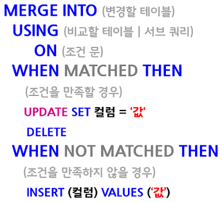

# SQL Appendix

from절의 서브쿼리는 order by 불가능

## 문자다루기

REPLACE(1,2,3)
1에 COLUMN을 넣고 2에 대체할 문자, 3에 대체될 문자 넣음

REPLACE("010-1234-5678", "-", " ") => 010 1234 5678
REPLACE("010-1234-5678", "-") => 01012345678

3번째 인자 안넣으면 NULL로 생각

SUBSTR(1,2,3)

1에 COLUMN, 2에 시작할 위치, 3에 뽑을 개수

2번은 1~N OR -N ~ -1

SUBSTR('HELLO', 3, 1) => L<br>
SUBSTR('HELLO', 3) => LLO<br>
SUBSTR('HELLO', 2, 3) => ELL<br>
SUBSTR('HELLO', -4, 3) => ELO<br>

대문자 변환 - UPPER()<br>
소문자 변환 - LOWER()

---

`COALESCE(’’, ‘’, ‘’)`

첫번째 인자부터 null이 아닌 값을 조회

💡 coalesce(null, ‘a’) => a <= ifnull(null, ‘a’)

nvl2('1', 2, 3)<br>
'1'이 null이라면 3 , null 이 아니라면 2


`NULLIF(A,B)` A와 B의 값이 같으면 NULL, 아니면 A를 출력

---

    PL/SQL은 예외처리가 필수가 아니다
>
    Lock/Unlock은 병행성 제어(동시성) 기법이다.
    not 무결성 보장 기법
>
    기본키(Primary Key)는 반드시 테이블 당 하나의 제약만을 정의할 수 있다.
>
    고유키(Unique Key)로 지정된 모든 칼럼은 중복된 값을 허용하진 않지만 NULL값은 가질 수 있다.
>
    별칭이 없는 칼럼은 대문자로 바뀌고, 별칭이 있는 칼럼은 그대로 사용

---

## 소수점

round(숫자, 자리수) 자리수만큼 소수자리 출력, 반올림

truncate(숫자, 자리수) 자리수만큼 소수자리 출력, 내림

ceil(숫자, 자리수) 자리수만큼 소수자리 출력, 올림

3개모두 자리수 없으면 0으로 취급

---

    UNION은 중복을 제거하고, `정렬`한다.

    LIKE 연산으로 %나 _가 들어간 문자를 검색하기 위해서는 ESCAPE 명령어를 사용할 수 있다. 사용 방법은 _나 % 앞에 ESCAPE로 특수 문자를 지정하면 검색할 수 있다.

---

## window function

윈도우 함수 = 행과 행간의 관계를 쉽게 정의하기 위해 만든 함수 이름

윈도우 함수의 형태

`함수(컬럼) OVER (Partition by 컬럼 Order by 컬럼)`

함수 : Min, Max, Sum, Count, Avg 등과 같은 기존의 함수 or 윈도우 함수용으로 추가된 함수 (row_number, dense_rank, rank)

OVER : over 은 윈도우 함수에서 꼭 들어가야 하며 Over 내부에 Partition By 절과 Order by 절이 들어갑니다.

partition by : 전체 집합을 어떤 기준(컬럼)에 따라 나눌지를 결정하는 부분.

order by : 어떤 항목(컬럼)을 기준으로 순위를 정할 지 결정하는 부분

    RANK() - 중복값은 중복등수, 등수 건너뜀 - 1,2,2,4,5
    DENSE_RANK() - 중복값은 중복등수, 등수 안 건너뜀 - 1,2,2,3,4
    ROW_NUMBER() - 중복값이 있어도 고유 등수 부여 - 1,2,3,4,5

>
    group by는 사용하면 데이터가 집약되지만
    윈도우 함수의 partition by는 집약되지 않고 구분만 해줌
>
    함수에 집계함수를 썼을떄(sum, avg, ...) order by를 사용하면 누적합처럼 한개씩 합쳐짐?

    ex) 누적합일때는 order by쓰고, 각 값의 비율은 order by 안씀

    여기서 order by를 안쓰면 같은 partition에는 같은 값이 들어감,
    order by를 쓰면 순서대로 더해짐(sum이나 count가)
    -> 각 값의 비율은 같은 값(분모)을 써야하기 떄문에 order by 안씀
    누적합은 순서대로 더해야 하기 때문에 order by 씀
>
    윈도함수를 쓰면 편하지만, order by를 할떄 조심해서 써야한다.
    -> 성능과 연관되어 있음

---

### 인덱스 생성
UNIQUE SCAN : 유일한 값 하나 찾기 (예: 고객아이디) *한개의 행

RANGE SCAN : 어떠한 조건에서 한 범위를 찾기 (예:주문번호)

FULL SCAN : 전체 데이터 *전체 행

---

문자형과 숫자형을 비교 시 문자형을 숫자형으로 묵시적 변환하여 비교한다.

CHAR는 길이가 서로 다르면 짧은 쪽에 스페이스를 추가하여 같은 값으로 판단한다. 같은 값에서 길이만 서로 다를 경우 다른 값으로 판단하는 것은 VARCHAR(가변길이 문자형 : 입력한 크기만큼 할당 )로 비교하는 경우이다

---

메인쿼리의 값을 서브쿼리에서 주입을 받아서 비교를 하는것으로 상호연관 서브쿼리(CORRELATED SUB QUERY) 이다.

---

서브쿼리에 있는 칼럼을 자유롭게 사용할수 없다

---

(오라클 DB에서)
오늘 날짜를 구하기 위해서 SYSDATE+1을 해주면된다. 단, 데이트 타입을 문자열 TO_CHAR 로 변환해주어야 한다.

---

ROLE은 데이터베이스에서 OBJECT(테이블, 프로시저, 뷰) 등의 권한을 묶어서 관리할 수 있다.

---

## 조인 수행 원리

    NATURAL JOIN에서 EMP.DEPTNO와 같이 OWNER 명을 사용하면 에러 발생
 
조인이란 두 개 이상의 테이블을 하나의 집합으로 만드는 연산이다.

FROM 절에 세 개의 테이블이 존재하더라도 세 개의 테이블이 동시에 조인이 수행되는 것은 아니다.<br>
세 개의 테이블 중에서 먼저 두 개의 테이블에 대해 조인이 수행된다. 그리고 먼저 수행된 조인 결과와 나머지 테이블 사이에서 조인이 수행된다. 

### 1. Nested Loop Join

중첩for문 방식

inner table에 인덱스가 걸려있지 않으면 굉장히 비효율적
> outer table에서 한건한건 조회할때마다 inner table을 full scan해야 하기 떄문

대량의 테이블을 조인하는 방식으로 적절하지 않다

크기가 작은 테이블이 outer table이 되야 성능에 유리하다
> 1:n이라면 1이 outer table로

### 2. Sort Merge Join

NL join에서 두 테이블을 우선 조인컬럼을 기준으로 정렬을 진행하고 조인을 진행한다.

> inner table에 적절한 인덱스가 없어서 NL join을 쓰기에 너무 비효율적일때 사용한다.

equal join이 아니라 범위로 join을 할때 적절한 수행 원리라고 할 수 있다.

table random access가 일어나지 않고 sorting 작업이 PGA영역에서 수행되기 떄문에

경합이 발생하지 않아 성능에 유리한 이점이 있다.

### 3. Hash Join

배치에서 쓰기 좋은 수행원리

대용량 테이블을 조인할떄 쓰기 좋은 조인

PGA영역에 해시 영역을 생성

첫번째 테이블을 해시 테이블에 넣는다.

그리고 두번쨰 테이블이 읽히면서 조인이 되는 원리

해쉬 영역에 올라갈때 JoinColumn을 기준으로 hash function이 적용되기 때문에

key 컬럼에 중복값이 없을수록 성능에 유리하다

> equal join만 가능하다. 범위 조인 x

> sort merge join처럼 random access 부하가 없다.

> 유의할점
>
> 해시영역에 들어가는 테이블의 크기가 충분히 작아야 성능에 유리하다.
>
> 너무 커지면 디스크 영역을 사용하게 되어 성능이 안좋아진다.

수행빈도가 높은 OLTP 환경에서 이 조인을 사용하게 되면<br>
오히려 CPU나 메모리의 사용량이 늘어서 성능이 안좋아질수있다.

---

# 인덱스(index)

조건을 만족하는 튜플들을 빠르게 조회하기 위해

    빠르게 정렬(order by)하거나 그룹핑(group by)하기 위해

인덱스를 저장하는데 생기는 오버헤드 & 인덱스를 유지하는데 생기는 오버헤드(DML로 바뀌면 인덱스도 업데이트 필요) 생각해야함

```CREATE [UNIQUE] INDEX 인덱스이름 ON 테이블이름(column 이름1, 2, ...)```

[UNIQUE]는 해당 COLUMN 들이 유니크할때만 가능

    대부분의 RDBMS에서, PK에 인덱스가 자동으로 생성된다.

MYSQL에서 어떤 인덱스 쓰는지 확인하는 방법 - EXPLAIN 명령어

MYSQL에서 특정 인덱스를 사용하도록 명령하는 방법 - USE INDEX, FORCE INDEX

> 조회하려는 데이터가 테이블의 상당 부분을 차지할때는 인덱스 말고 FULL SCAN을 사용하는 것이 좋다.

    인덱스에 해당하는 column에 연산하면 인덱스수행안됨
    VARCHAR, CHAR, DATE, NUMBER 모두 인덱스 생성이 가능하다.
---

### 트리기반 인덱스 (B+Tree)
Branch 블록과 Leaf 블록으로 구성되있으며, 브랜치 블록을 루트 블록이라고 한다.

브랜치 블록은 분기를 목적으로 하고, 리프블록은 인덱스를 구성하는 컬럼의 값으로 정렬되며, OLTP 시스템 환경에거 가장 많이 사용된다. 

인덱스를 생성할 때 동일 컬럼으로 구성된 인덱스를 중복해서 생성할 수 없다. 그러나 인덱스 구성 컬럼은 동일하지만 컬럼 순서가 다르면 서로 다른 인덱스로 생성. JOB + SAL 과 SAL + JOB은 다르다.

데이터가 전체 데이터의 10%의 적은 데이터에서 사용하는 것이 유용하다.

    `B-tree vs B+tree`

    B-tree는 리프노드가 아닌 노드에도 VALUE(데이터)가 있다.
    B+tree는 리프노드에만 VALUE(데이터)가 있다. & 리프노드끼리 연결되어 있음
    -> 범위 검색 빠름

---

### DUAL 테이블

더미 column만 있는 테이블,

그냥 함수 결과나 현재 시간 구할때 쓴다.

---

### DECODE

오라클의 if else 문

DECODE(컬럼, 조건1, 결과1, 조건2, 결과2, ...)

---

### MERGE

UPDATE와 INSERT를 한방에 해결해주는 쿼리

    한 테이블에 해당하는 데이터가 있으면 UPDATE하고 없으면 INSERT 해라



---

count는 해당 column이 null이면 세지않음

in에 null은 포함안함

0+null = null

---

연산자 우선순위

산술 연산자(*, /, +, -)
연결 연산자 (||)
비교 연산자(<, >, <=, =>, <>, =)
IS NULL, LIKE, IN
BETWEEN
NOT 연산자
AND 연산자
OR 연산자

---

순수 관계 연산자란, 관계형 데이터베이스에 적용할 수 있도록 개발한 관계 연산자를 의미한다.

select, project, division, join