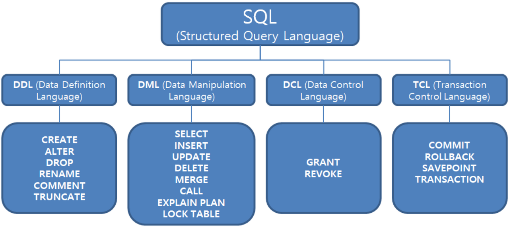

# SQL(Structed Query Language)

sql이란 데이터를 관리하기 위해 설계된 특수 목적의 프로그래밍 언어이다.

SQL문 실행 순서 예제 
⑤ SELECT 
① FROM 
② WHERE 
③ GROUP BY 
④ HAVING 
⑥ ORDER BY 

---

## DDL(Data Definition Language, 데이터 정의어) - Auto Commit

DB 구조 또는 스키마를 정의하는데 사용

> 주의: 직접 DB의 테이블에 영향을 미치기 때문에 DDL 명령어를 입력하는 순간,  
> 명령어에 해당하는 작업이 `즉시 커밋`된다는것을 기억하자

CREATE - 데이터베이스의 객체를 생성

ALTER - 데이터베이스의 구조를 변경

DROP - 데이터베이스의 객체를 삭제 (테이블의 모든 데이터와 구조를 삭제)

TRUNCATE - 테이블을 초기화

RENAME - 데이터베이스의 객체 이름 변경

COMMENT - 데이터에 주석등을 추가

※SCHEMA, DOMAIN, TABLE, VIEW, INDEX를 정의하거나 변경 또는 삭제할 때 사용하는 언어

※데이터 베이스 관리자나 데이터베이스 설계자가 사용

👉 CREATE 규칙

- 객체를 의미하는 것이므로 단수형으로 이름을 짓는걸 권고한다.
- 유일한 이름으로 명명해야 한다.
- 테이블 내의 컬럼명 또한 중복되지 않는 유일한 이름으로 명명해야 한다.
- 정의할 때 각 컬럼은 ,으로 구분하며 테이블 생성문의 마지막은 ;이다.
- 컬럼명은 데이터 표준화 관점에서 일관성 있게 사용해야 한다.
- 컬럼 뒤에 데이터 유형을 반드시 지정해야 한다.
- 테이블과 컬럼명은 반드시 문자로 시작한다.
- 대소문자 구분을 하지 않지만, 기본적으로 대문자로 만들어진다.

👉 ALTER: 컬럼 변경 문법

|명령어|내용|
|--|--|
|ADD COLUMN|컬럼을 추가하는 역할|
|DROP COLUMN|컬럼을 삭제하는 역할|
|MODIFY COLUMN|컬럼을 수정하는 역할|
|RENAME COLUMN|컬럼 이름을 변경하는 역할|
|DROP CONSTRAIN|컬럼을 제약조건을 기반해서 삭제하는 역할|

---

## DML(Data Manipulation Language)

정의된 데이터베이스에 입력된 레코드를 조회하거나 수정하거나 삭제하는 등의 역할을 하는 언어

SELECT	데이터베이스에서 데이터를 검색하는 역할

INSERT	테이블에 데이터를 추가하는 역할

UPDATE	테이블 내에 존재하는 데이터를 수정하는 역할

DELETE	테이블에서 데이터를 삭제하는 역할

---

## DCL(Data Control Language)

데이터를 관리 목적으로 보안, 무결성, 회복, 병행 제어 등을 정의하는데 사용한다. DCL을 사용하면 데이터베이스에 접근하여 읽거나 쓰는 것을 제한할 수 있는 권한을 부여하거나 박탈할 수 있고 트랜잭션을 명시하거나 조작할 수 있다.

GRANT - 권한을 정의할때 사용하는 명령어

REVOKE - 권한을 삭제할때 사용하는 명령어

---

## TCL (Transaction Control Language)

DCL과 비슷한 맥락이지만 데이터를 제어하는 언어가 아닌 트랜잭션을 제어할때 사용한다. 논리적인 작업 단위를 묶어 DML에 의해 조작된 결과를 트랜잭션 별로 제어한다.

COMMIT	모든 작업을 정상적으로 처리하겠다는 명령어

ROLLBACK	모든 작업을 다시 돌려 놓겠다는 명령어

SAVEPOINT	Commit 전에 특정 시점까지만 반영하거나 Rollback하겠다는 명령어
