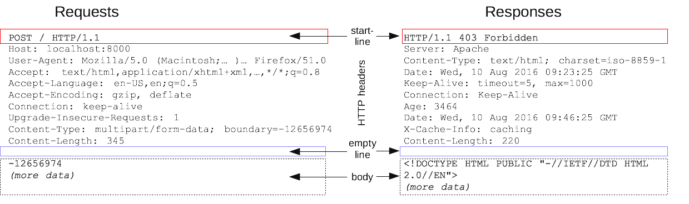
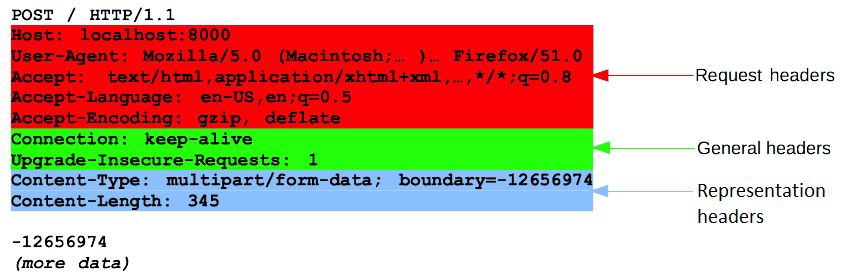
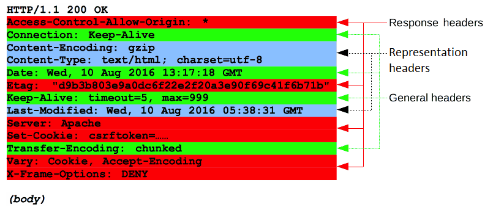

# HTTP Message

HTTP 메시지는 서버와 클라이언트 간에 데이터가 교환되는 방식

메시지 타입은 요청과 응답 두가지가 있다.

요청(request)은 클라이언트가 서버로 전달해서 서버의 액션이 일어나게끔 하는 메시지이고,  
응답('response')은 요청에 대한 서버의 답변이다.

HTTP 메시지는 ASCII로 인코딩된 텍스트 정보이며, 여러 줄로 되어 있다.

---

## 요청과 응답의 공통 구조

HTTP 요청과 응답의 구조는 서로 닮았으며, 그 구조는 다음과 같다.

1. 시작 줄(start-line)에는 실행되어야 할 요청, 또은 요청 수행에 대한 성공 또는 실패가 기록되어 있다.  
   (이 줄은 항상 한 줄로 끝난다)
2. 옵션으로 HTTP 헤더 세트가 들어간다. 여기에는 요청에 대한 설명, 혹은 메시지 본문에 대한 설명이 들어간다.
3. 요청에 대한 모든 메타 정보가 전송되었음을 알리는 빈 줄이 삽입된다.
4. 요청과 관련된 내용(HTML 폼 콘텐츠 등)이 옵션으로 들어가거나, 응답과 관련된 문서가 들어간다.  
   (본문의 존재 유무 및 크기는 첫 줄과 HTTP 헤더에 명시되어 있다)



---

## 요청(Request) 메시지

### Request Start-Line

```GET / HTTP/1.1```  
```{HTTP Method} {Path} {HTTP Version}```

HTTP Method: GET, POST, PUT, PATCH, DELETE, HEAD, OPTIONS 등  
Path (끝에 '?'과 쿼리 파라미터 형식이 따라온다)  
HTTP Version

### Request Header

대소문자 구분없는 문자열 다음에 콜론(':')이 붙으며, 그 뒤에 오는 값은 헤더에 따라 달라진다.  
헤더는 값까지 포함해 한 줄로 구성되지만, 꽤 길어질 수 있다.

다양한 종류의 요청 헤더가 있는데, 이들은 다음과 같이 몇몇 그룹으로 나눌 수 있다.
- Via와 같은 General 헤더는 메시지 전체에 적용된다.
- User-Agent (en-US), Accept와 같은 Request 헤더는 요청의 내용을 좀 더 구체화 시키고(Accept-Language),  
  컨텍스를 제공하기도 하며(Referer),  
  조건에 따른 제약 사항을 주기도 하면서(If-None) 요청 내용을 수정한다.
- 메시지 데이터의 원래 형식과 적용된 인코딩을 설명하는 Content-Type과 같은 Representation 헤더(메시지에 본문이 있는 경우에만 존재한다).

### Request body(Contents)

넓게 보면 본문은 두가지 종류로 나뉜다.
1. Content-Type와 Content-Length로 정의된 단일 파일로 구성되는 단일-리소스 본문(single-resource body)  
   (HTML 폼이나 JSON 데이터)
2. multipart/form-data 헤더에 대한 데이터

> GET, HEAD, DELETE , OPTIONS처럼 리소스를 가져오는 요청은 보통 본문이 필요 없다.

---

### 전체 Request 구조



---

## 응답(Response) 메시지

### Response Start-Line

```HTTP/1.1 200 OK```  
```{HTTP Version} {HTTP Status} {Status message}```

HTTP Version  
HTTP Status: 요청의 성공 여부(200, 404, 302 등)  
Status message: HTTP Status를 이해하는데 도움이 되는 짧은 메시지

### Response Header

응답에 들어가는 HTTP 헤더는 요청 헤더와 동일한 구조를 따른다.

다양한 종류의 응답 헤더가 있는데, 이들은 다음과 같이 몇몇 그룹으로 나눌 수 있다.
- Via와 같은 General 헤더는 메시지 전체에 적용된다.
- Vary와 Accept-Ranges와 같은 Response 헤더는 상태 줄에 포함되지 않은 서버에 대한 추가 정보를 제공한다.
- 메시지 데이터의 원래 형식과 적용된 인코딩을 설명하는 Content-Type와 같은 Representation 헤더(메시지에 본문이 있는 경우에만 존재한다).

### Response Body

넓게 보면 본문은 세가지 종류로 나뉜다.
- Content-Type와 Content-Length라는 두 개의 헤더로 정의하는 길이가 알려진 하나의 파일로 구성된 단일-리소스 본문(Single-resource bodies).
- Transfer-Encoding가 chunked로 설정된 청크로 나뉘어 인코딩되는 길이를 모르는 하나의 파일로 구성된 단일-리소스 본문.
- 서로 다른 정보를 담고 있는 멀티파트 본문으로 이루어진 다중 리소스 본문: 이 경우는 상대적으로 위의 두 경우에 비해 보기 힘들다.

> 모든 응답에 본문이 들어가지는 않는다.  
> 해당 페이로드 없이도 요청에 충분히 응답하는 201 Created, 204 **No Content**과 같은 상태 코드를 가진 응답에는 보통 본문이 없다.



---

// TODO HTTP/2 Frame 구조

