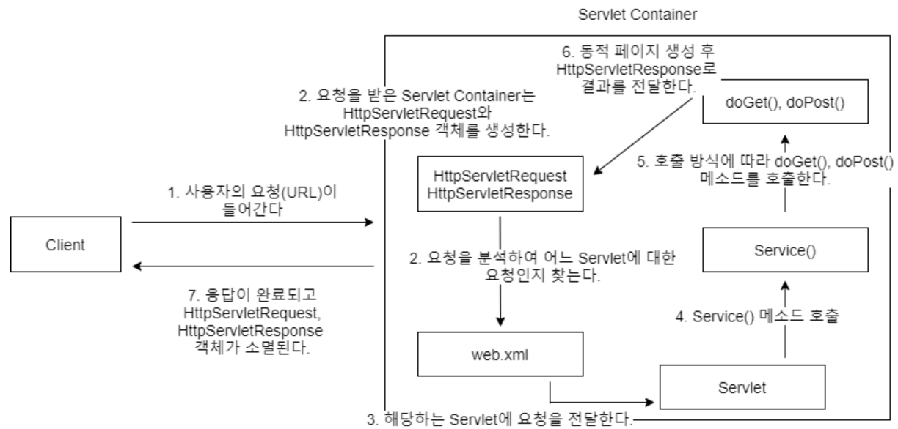

# 서블릿

클라이언트의 요청을 처리하고, 그 결과를 반환하는 Servlet 클래스의 구현 규칙을 지킨 자바 웹 프로그래밍 기술

> 자바를 사용하여 웹을 만들기 위해 필요한 기술

> 웹을 만들때는 다양한 요청(Request)과 응답(Response)이 있기 마련이고 이 요청과 응답에는 규칙이 존재한다.  
> 이러한 요청과 응답을 일일이 처리하려면 굉장히 힘들 것이다.  
> 서블릿은 이러한 웹 요청과 응답의 흐름을 간단한 메서드 호출만으로 체계적으로 다룰 수 있게 해주는 기술이다.

---

## 서블릿 Life Cycle

1. Servlet 객체 생성 (1회)
2. init() 호출 (1회)
3. service(), doGet(), doPost() 호출 (요청시 매번)
4. destroy() 호출 (1회)

> 모든 요청에 대해 service()를 통해 doXXX() 메서드가 호출된다.

---

> 사블릿은 요청을 받거나 응답을 보낼 떄, 자신이 알아서 하는 것이 아니라 서블릿을 실행시켜주는 서블릿 컨테이너라는 것을 이용한다.

## 서블릿 컨테이너

서블릿을 담고, 관리해주는 컨테이너

요청에 대해 어떤 서블릿을 실행할 것인지 제어한다.

서블릿이 웹 서버와 통신할 수 있도록 해준다.

대표적으로 Tomcat이 있다.

---

### 서블릿 컨테이너 주요 기능

1. 생명주기 관리  
   서블릿 컨테이너가 기동 되는 순간 서블릿 클래스를 로딩해서 인스턴스화 하고, 초기화 메서드를 호출하고, 요청이 들어오면 적절한 서블릿 메서드를 찾아서 동작한다.  
   서블릿의 생명이 다하는 순간 GC를 통해 메모리에서 제거된다.
2. 통신 지원  
   클라이언트의 request를 받고, response를 보낼 수 있게 웹 서버와 소켓을 만들어서 통신을 해준다.
   > 서블릿 컨테이너가 소켓을 만들고 listen, accept 등의 기능을 API로 제공하여  
   > 복잡한 과정을 생략할 수 있게 해주고  
   > 개발자로서 비즈니스 로직에 더욱 집중할 수 있게 만들어 준다.
3. 멀티스레딩 관리  
   서블릿 컨테이너는 해당 서블릿의 요청이 들어오면 스레드를 생성해서 작업을 수행한다.
4. 보안 관리  
   (보안 관리는 XML에 기록한다 -> 이를 수정해도 재컴파일 할 필요 없다)
   
---

### 서블릿 컨테이너 동작 과정

