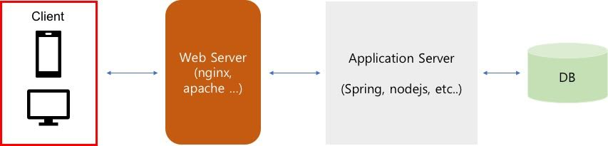

## Web Server

웹 서버란 이미지, 동영상, 자바스크립트, HTML, 등 다양한 문서를 제공하는 소프트웨어

주로 HTTP를 통해 리소스를 전달한다.

대부분의 웹 서비스는 위의 아키텍처처럼 구성되어 있으며 웹 서버는 다음과 같은 역할을 주로 담당하게 된다.

1. 정적 콘텐츠 제공  
    HTML 텍스트 파일을 비롯하여 이미지나 음성 데이터 같은 정적인 컨텐츠를 클라이언트에게 전송한다.  
   (사용자로부터 동적인 요청이 들어왔을 때 해당 요청을 웹서버 자체적으로 처리하기 어렵기 때문에 해당 요청을 WAS에게 요청)
2. 프록시 처리  
   클라이언트의 요청을 WAS로 전달하는 역할을 한다.  
   이를 이용해 캐시 처리 기능, 로드 밸런싱 기능, 암호화 기능 등을 처리할 수 있다.

---

## 웹 서버의 종류

웹 서버는 대표적으로 Apache와 Nginx가 있다.

### Apache

Apache 웹 서버는 각각의 새 요청에 대해 새 스레드를 생성하는  
`프로세스/스레드 기반 아키텍처`이다.

단점
1. 클라이언트 접속 시 마다 프로세스 또는 스레드를 생성하는 구조이기에 대량의 클라이언트(1만 이상)가 동시 접속한다면 CPU/메모리 사용이 증가하고 프로세스/스레드 생성 비용이 드는 등 요청에 한계가 있다.
2. Apache 서버의 프로세스가 blocking되면 요청을 처리하기 못하고 처리가 완료될 때 까지 계속 대기하게 된다.

장점으로는 모듈을 추가하기 쉽다는 확장성과, 호환성이 높다는 특징이 있다.

### Nginx

`이벤트 처리 기반 아키텍처`

한 개 또는 고정된 프로세스만 생성하고, 여러 개의 Connection을 모두 Event-Handler를 통해 비동기 방식으로 처리한다.  
적은 양의 스레드만 사용되기 때문에 Context Swiching 비용이 적다. 즉 CPU 부하가 적다.

> Apache와 달리 동시 접속자 수가 많아져도 추가적인 생성 비용이 들지 않는다.

CPU와 관계없이 모든 I/O들을 전부 Event Listener로 미루기 때문에 흐름이 끊기지 않고 응답이 빠르게 진행되어 1개의 프로세스로 더 빠른 작업이 가능하다.  
이 덕분에 메모리를 적게 사용하게 된다.

그리고 프로세스를 적게 만들기 때문에, 동적 설정 변경이 가능하다 -> 로드 밸런싱 가능

단점  
1. 개발자가 직접 기능 추가를 하면, 실행 중인 프로세스들은 종료해야 한다.  
   -> 해당 프로세스가 관리하는 사용자 요청을 처리할 수 없게 된다.  
   -> 개발자가 직접 모듈을 만들기가 까다롭다.
2. 여러 OS에 호환성이 아파치보다 높지 않다.

---

### Apache vs Nginx

|    | Apache                                 | Nginx             |
|----|----------------------------------------|-------------------|
| 특징 | 프로세스/스레드 기반 아키텍처                       | 이벤트 처리 기반 아키텍처    |
| 장점 | 서버 자체가 다양한 OS에서 안정적이다, 확장성이 높다.        | 리소스 사용량이 적다.      |
| 단점 | 사용자 요청이 많아지면, 리소스 사용량이 증가한다. (C10K 문제) | 직접 모듈을 만들기가 까다롭다. |
| 정리 | 호환성, 확장성이 높다.                          | 동시 처리량이 높다.       |

> C10K 문제를 해결하기 위해 Apache는  
> MPM(Multi Processing Module)을 도입해 성능을 개선했다.
